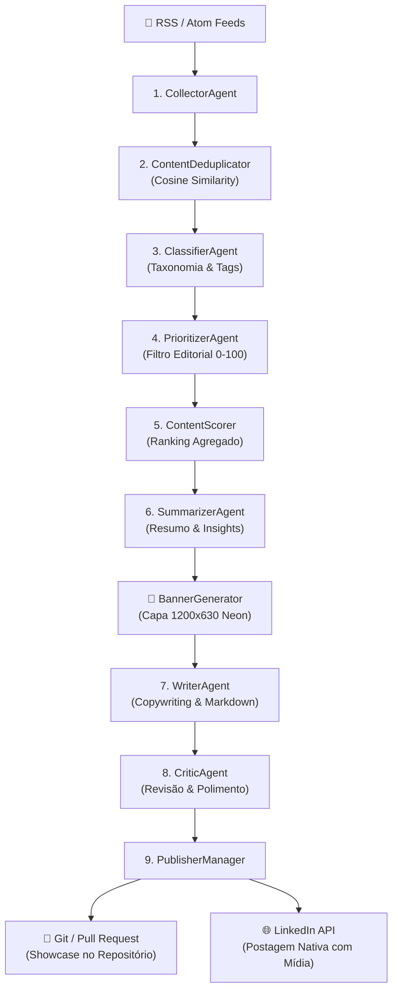

# 🚀 Insight Forge

> **Autonomous Multi-Agent AI System for Technical Content Curation, Semantic Ranking, Dynamic Copywriting & Multi-Channel Automated Publishing.**


---

## 📌 Sobre o Projeto

O **Insight Forge** é um ecossistema autônomo baseado em **6 Agentes Especializados de IA** operando em uma arquitetura desacoplada e modular. O sistema monitora fontes de conteúdo técnico (como feeds RSS/Atom), elimina notícias duplicadas via similaridade semântica (Cosine Similarity), ranqueia relevância por algoritmos de pontuação, sumariza pontos-chave, redige posts otimizados para redes profissionais (com copywriting de conversão) e gera capas visuais exclusivas em *dark mode neon* antes de publicar via API e abrir Pull Requests automáticos no GitHub.

---

## 🤖 Arquitetura do Pipeline Multiagente



---

## ✨ Principais Funcionalidades

- **🤖 Ecossistema Multiagente Modular**:
  - `CollectorAgent`: Coleta e higieniza matérias brutas do feed.
  - `ClassifierAgent`: Categoriza assuntos técnicos (IA, Data, Python, Cloud) e gera tags.
  - `PrioritizerAgent`: Avalia rigorosamente se a matéria merece publicação.
  - `SummarizerAgent`: Extrai resumos executivos e pontos-chave.
  - `WriterAgent`: Redige o artigo otimizado com ganchos (hooks) de alta retenção.
  - `CriticAgent`: Atua como editor-chefe revisando o texto e eliminando clichês de IA.
- **🎨 Gerador Dinâmico de Capas Visuais (`BannerGenerator`)**:
  - Cria automaticamente capas em alta resolução (1200x630px) no estilo *Dark Mode Neon* para acompanhar cada postagem.
- **📊 Deduplicação e Ranking Semântico**:
  - Evita republicações usando n-gramas e TF-IDF para calcular similaridade cosseno entre matérias.
- **🌐 Publicadores Multi-Canal (`PublisherManager`)**:
  - Publica nativamente com anexos de imagem via **LinkedIn REST API v202502**.
  - Versão em Markdown salva e rastreada via **GitOps / Pull Request**.
- **⚙️ Automação Diária (GitHub Actions)**:
  - Workflow agendado via Cron (diariamente às 08:00 BRT) para execução autônoma.

---

## 🛠️ Tecnologias Utilizadas

- **Linguagem**: Python 3.12
- **Provedor de LLM**: Google Gemini API (`google-genai` SDK com fallback inteligente de modelos)
- **Manipulação de Imagem**: Pillow (PIL)
- **Automação & CI/CD**: GitHub Actions (Workflows & Pull Requests automatizados)
- **Métricas e ML**: Scikit-learn / Numpy (TF-IDF & Cosine Similarity)

---

## 🚀 Como Executar Localmente

### 1. Clonar o Repositório
```bash
git clone https://github.com/rafaelrodrigopa/insight-forge.git
cd insight-forge
```

### 2. Criar e Ativar o Ambiente Virtual
```bash
python -m venv .venv

# No Linux/macOS:
source .venv/bin/activate

# No Windows (PowerShell):
.\.venv\Scripts\activate
```

### 3. Instalar as Dependências
```bash
pip install -r requirements.txt
```

### 4. Configurar as Variáveis de Ambiente (`.env`)
Crie um arquivo `.env` na raiz do projeto:
```env
GEMINI_API_KEY=sua_chave_aqui
LINKEDIN_ACCESS_TOKEN=seu_token_opcional_aqui
```

### 5. Executar o Pipeline Multiagente
```bash
# Execução padrão (geração Markdown)
python main.py

# Execução no formato otimizado para o LinkedIn com capa visual
python main.py --linkedin

# Execução completa com publicação direta no LinkedIn e Git
python main.py --linkedin --publish --force
```

---

## 🧪 Suíte de Testes Automatizados

O projeto conta com testes unitários cobrindo todos os agentes e publicadores:

```bash
python -m unittest discover -s tests
```

---

## ⚙️ Configuração no GitHub Actions

Para ativar a execução diária e publicação automática na nuvem:

1. Acesse seu repositório no GitHub ➔ **Settings** ➔ **Secrets and variables** ➔ **Actions**.
2. Adicione as seguintes Secrets:
   - `GEMINI_API_KEY`: Sua chave de API do Gemini.
   - `LINKEDIN_ACCESS_TOKEN` *(opcional)*: Token OAuth do LinkedIn.
3. Em **Settings** ➔ **Actions** ➔ **General** ➔ **Workflow permissions**, selecione **Read and write permissions**.

---

## 👨‍💻 Autor & Contribuições

Desenvolvido por **Rafael Almeida** 🚀

- 🌐 **Site / Portfólio**: [rafaelrodrigopa.com.br](https://www.rafaelrodrigopa.com.br/insight-forge)
- 💼 **LinkedIn**: [linkedin.com/in/rafaelrodrigopa](https://www.linkedin.com/in/rafaelrodrigopa)

---

## 📜 Licença

Este projeto está licenciado sob a licença **MIT** — veja o arquivo [LICENSE](LICENSE) para mais detalhes.
