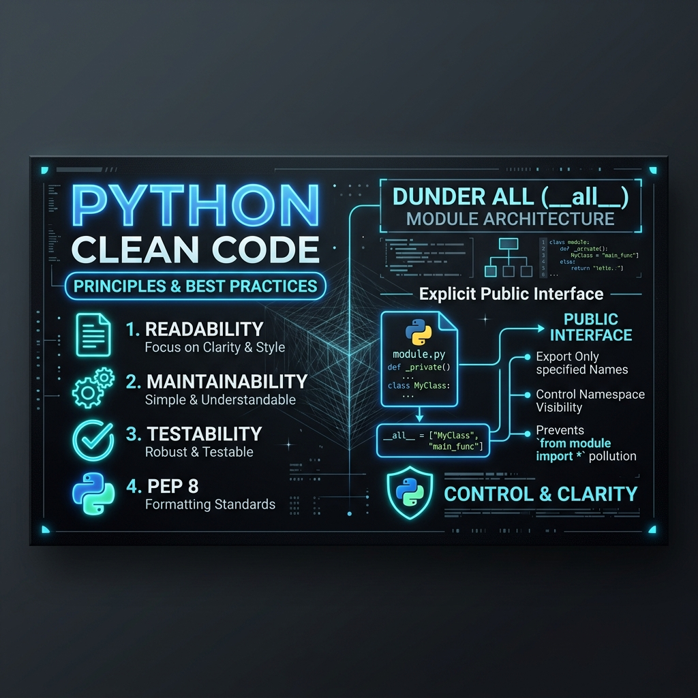

Seu código Python está expondo funções internas e detalhes de implementação sem você perceber? 🐍

O uso do sintaxe curinga `from module import *` costuma poluir o namespace global, importando funções auxiliares, variáveis temporárias e dependências de terceiros para o escopo de quem consome seu pacote.

Para resolver isso de forma nativa e elegante, o Python oferece a variável especial `__all__` (*dunder all*).

Com ela, você estabelece um contrato explícito do que constitui a **API Pública** do seu módulo:

```python
# meu_modulo.py
__all__ = ["calcular_total"]  # Apenas este símbolo é exportado no `import *`


def calcular_total(a, b):
    return a + b


def _helper_interno():
    # Esta função não é exportada na importação por curinga
    pass
```

Ao declarar `__all__`, você assume o controle da interface do módulo e reduz efeitos colaterais indesejados.

💡 **Impactos diretos na arquitetura do código:**

📌 **Controle de Exportação:** Garante que apenas os símbolos públicos sejam expostos em importações abrangentes.
🏗️ **Contrato de API Claro:** Funciona como documentação explícita da interface pública, orientando tanto desenvolvedores quanto IDEs, geradores de documentação e linters.
🛡️ **Encapsulamento e Manutenibilidade:** Protege a implementação interna contra dependências indevidas criadas por consumidores do módulo.

Embora o PEP 8 recomende evitar o `from module import *` no código do dia a dia, a definição de `__all__` continua sendo uma boa prática indispensável para estruturar pacotes Python robustos e previsíveis. ⚙️

---

💬 **E no seu time:** vocês usam a `__all__` para delimitar a API pública de pacotes ou preferem proibir o `from module import *` diretamente nas regras do linter? Vamos debater nos comentários!

#Python #CleanCode #SoftwareEngineering #Backend #PythonProgramming #DevCommunity

