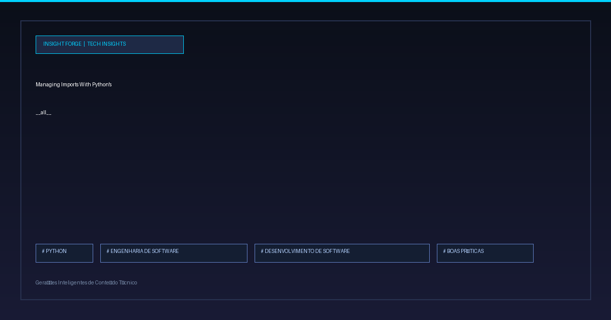

O uso indiscriminado de importações curinga (`from module import *`) em Python frequentemente resulta em namespaces poluidos. Essa prática importa para o escopo atual todas as variáveis, funções e classes definidas em um módulo, incluindo utilitários internos que deveriam permanecer encapsulados.

Para mitigar esse problema e estruturar APIs públicas de forma previsível, o Python disponibiliza uma ferramenta nativa: a variável dunder `__all__`.

### O Contrato Explícito de `__all__`

A variável especial `__all__` funciona como uma whitelist explícita para o módulo. Declarada no topo do arquivo como uma lista de strings, ela define exatamente quais elementos serão expostos quando um comando `import *` for executado.

```python
# meu_modulo.py

__all__ = ["MinhaClassePublica", "funcao_publica"]

def funcao_publica():
    pass

def _funcao_privada_interna():
    pass

class MinhaClassePublica:
    pass

class _ClasseAuxiliar:
    pass
```

Caso um consumidor utilize `from meu_modulo import *`, apenas `MinhaClassePublica` e `funcao_publica` serão importadas. Elementos omitidos em `__all__` — mesmo aqueles que não começam com underscore — permanecem inacessíveis via importação curinga.

### Benefícios Arquiteturais

1. **Controle Rigoroso da API Pública:** Comunica explicitamente quais componentes foram projetados para consumo externo e quais são detalhes de implementação.
2. **Namespace Limpo:** Impede o vazamento de funções auxiliares e variáveis temporárias para o escopo de módulos clientes.
3. **Manutenibilidade e Refatoração:** Facilita a evolução do código, tornando o contrato do módulo evidente diretamente no código-fonte, reduzindo o acoplamento acidental.

### Considerações Práticas

Embora `__all__` controle especificamente o comportamento de `import *`, sua adoção é amplamente recomendada em bases de código de grande escala como uma boa prática de documentação e design de interfaces. Ferramentas de análise estática e IDEs também utilizam essa definição para melhorar o auto-completar e alertas de linting.

Escrever código limpo em Python vai além de garantir o funcionamento correto; trata-se de tornar a intenção arquitetural evidente para outros engenheiros. 

E você, costuma definir explicitamente a API pública dos seus módulos ou prefere o comportamento padrão de importação? 

---

🔗 Confira mais sobre este e outros projetos no meu site: [rafaelrodrigopa.com.br/linkedin-post](https://www.rafaelrodrigopa.com.br/linkedin-post)

#DataAnalytics #DataEngineering #Python #SoftwareEngineering #Cloud #Analytics #SQL #CleanCode #TechCommunity

