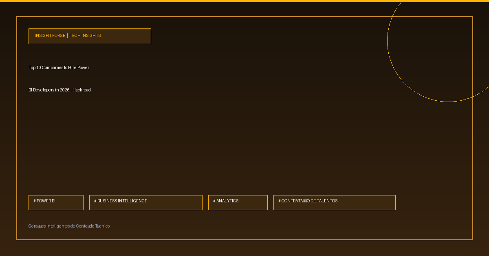

Sua empresa consegue escalar a arquitetura de BI sem esbarrar na escassez de desenvolvedores especializados? 

A demanda por especialistas em Power BI e Microsoft Fabric para 2026 confirma que a eficiência na entrega de dados exige parceiros técnicos consolidados. Com a complexidade crescente das pipelines e a necessidade de governança rigorosa, encontrar profissionais qualificados tornou-se um desafio central para lideranças que buscam transformar volume de dados em decisões estratégicas de alto impacto.

O mapeamento atualizado do mercado destaca as principais empresas parceiras globais para acelerar a implementação e a escala de dashboards analíticos com velocidade, segurança e governança.

🚀 **Projeção 2026:** Crescimento acelerado impulsionado pela convergência nativa do Power BI com o Microsoft Fabric.
💡 **Escalabilidade:** Estratégias táticas para gestores terceirizarem com segurança e eliminarem gargalos operacionais em Business Intelligence.
⚙️ **Seleção de Elite:** Mapeamento das 10 principais empresas parceiras para contratação e alocação de engenharia de dados e BI.
📌 **Performance:** Foco na criação de pipelines analíticos robustos, otimizados para suporte à decisão em tempo real.

Sua equipe interna já está preparada para a integração avançada com o Microsoft Fabric, ou a terceirização especializada tornou-se o caminho mais eficiente no seu planejamento estratégico?

🔗 Confira mais sobre este e outros projetos no meu site: https://www.rafaelrodrigopa.com.br/linkedin-post

#DataAnalytics #DataEngineering #Python #SoftwareEngineering #Cloud #Analytics #SQL #CleanCode #TechCommunity

