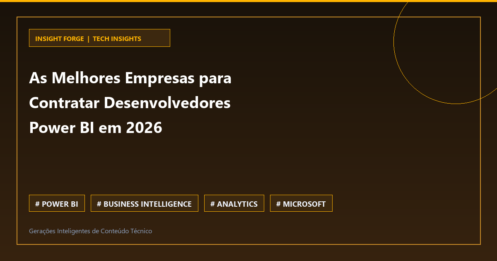

Sua empresa ainda toma decisões estratégicas baseadas em palpites por falta de dashboards verdadeiramente performáticos?
A demanda por especialistas em Power BI alcança novos patamares em 2026, tornando a escalabilidade de times internos de dados um gargalo crítico para a operação.

O mercado de Business Intelligence evoluiu significativamente. Não basta construir relatórios visuais atraentes; a complexidade atual exige modelagem dimensional sólida, DAX otimizado e governança estruturada no ecossistema Microsoft.

Para acelerar entregas e garantir eficiência, organizações estão migrando para consultorias e modelos de outsourcing de alta performance:

💡 **Demanda Estruturada:** A busca por um Business Intelligence maduro exige profissionais focados na geração direta de ROI.
📊 **Outsourcing Especializado:** A alocação de consultorias reduz o tempo de implementação de projetos complexos de Analytics.
⚙️ **Ecossistema Microsoft:** Foco em arquiteturas escaláveis que integram Power BI, SQL e ambientes em Nuvem (como Fabric e Azure).
🛡️ **Cultura Data-Driven:** As empresas líderes em 2026 são aquelas capazes de transformar volumes de dados em inteligência acionável.

Qual tem sido o maior desafio no seu time hoje: encontrar engenheiros e analistas sêniores de Power BI ou otimizar a performance da arquitetura de dados atual?

🔗 Confira mais sobre este e outros projetos no meu site, link no primeiro comentário

#DataAnalytics #DataEngineering #Python #SoftwareEngineering #Cloud #Analytics #SQL #CleanCode #TechCommunity

