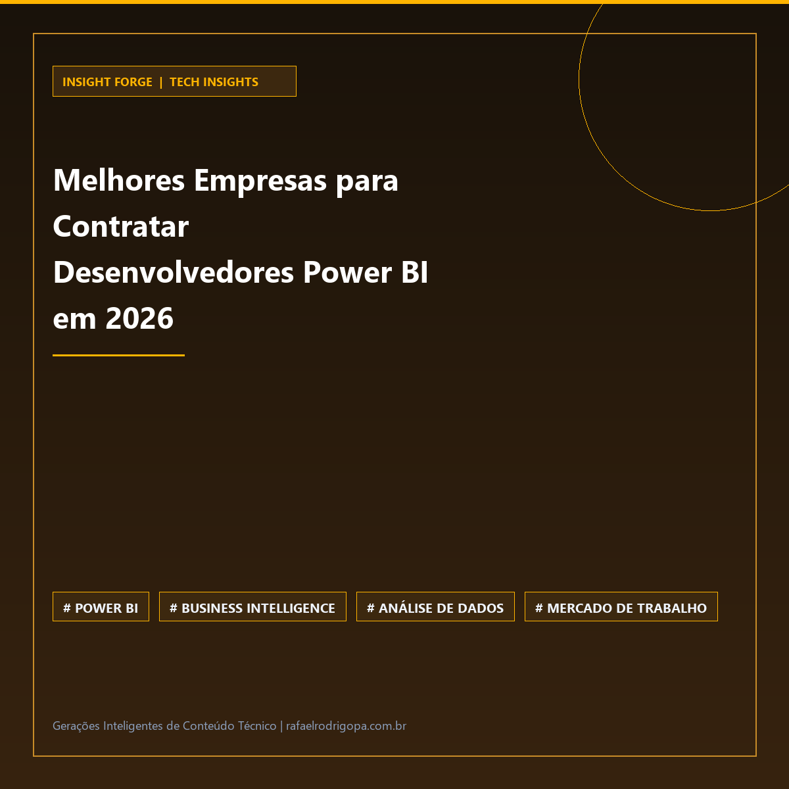

Sua empresa ainda disputa os mesmos talentos em Power BI de anos anteriores ou já percebeu que o mercado mudou drasticamente?

A demanda por especialistas em Business Intelligence da Microsoft atingiu um patamar inédito, e as organizações competem acirradamente pelos melhores profissionais de dados.

📌 O cenário de contratações para 2026 exige novas estratégias de recrutamento em tecnologia.
🚀 A escassez de especialistas qualificados em visualização de dados elevou o valor estratégico da área.
⚙️ Empresas líderes já estão mapeando as melhores consultorias e agências para blindar seus projetos de BI.

Como a sua equipe está se preparando para atrair e reter talentos analíticos de alto nível neste cenário competitivo?

🔗 Confira mais sobre este e outros projetos no meu site, link no primeiro comentário

#DataAnalytics #DataEngineering #Python #SoftwareEngineering #Cloud #Analytics #SQL #CleanCode #TechCommunity

