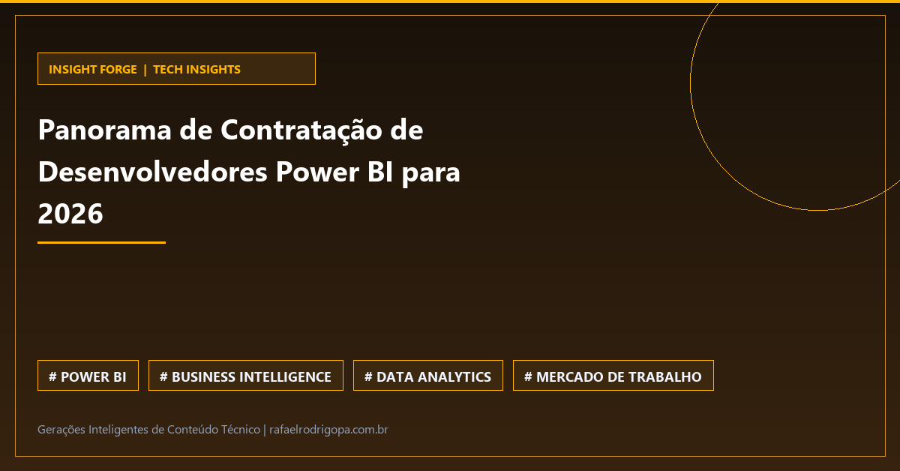

Sua empresa ainda sofre para transformar dados brutos em decisões estratégicas ou o Power BI continua sendo apenas uma ferramenta de gráficos bonitos?

O mercado de tecnologia para 2026 está exigindo muito mais do que relatórios estáticos. A demanda por desenvolvedores especializados no ecossistema Microsoft não para de crescer, impulsionando a expansão analítica das principais corporações globais.

⚙️ 10 empresas líderes mapeadas focadas em consultoria e recrutamento de elite em Power BI para 2026.
📊 Valorização recorde de profissionais de Business Intelligence capazes de conectar dados complexos a resultados de negócio.
🚀 Foco total na arquitetura de dados corporativos e na capacidade de transformar visualizações em tomadas de decisão ágeis.

Como você está preparando a sua stack de análise de dados para atender a esse novo patamar de exigência do mercado em 2026?

🔗 Confira mais sobre este e outros projetos no meu site, link no primeiro comentário

#DataAnalytics #DataEngineering #Python #SoftwareEngineering #Cloud #Analytics #SQL #CleanCode #TechCommunity

