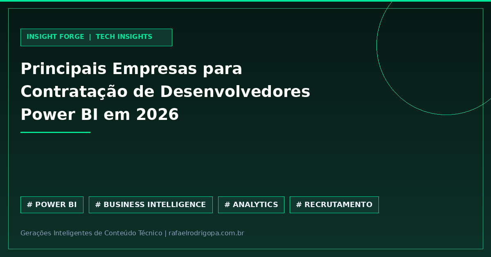

Sua empresa ainda sofre para transformar dados brutos em decisões estratégicas, ou você é o analista preso em planilhas infinitas?

O mercado de Business Intelligence passa por uma transformação profunda. O mapeamento recente divulgado pela Hackread para 2026 escancara a corrida das grandes corporações por especialistas capazes de dominar o ecossistema de dados.

📊 As principais empresas do mercado já estão disputando a dedo desenvolvedores Power BI focados em alta performance.
🚀 A demanda por profissionais que estruturam pipelines e dashboards executivos explodiu, valorizando quem domina a ferramenta de ponta a ponta.
⚙️ O ecossistema Microsoft continua sendo o padrão-ouro corporativo para unificar fontes complexas e acelerar a tomada de decisão.
📌 O futuro pertence a quem não apenas entrega relatórios, mas traduz métricas em vantagens competitivas reais para o negócio.

Como você está se preparando para as exigências técnicas que o mercado de dados exige em 2026?

🔗 Confira mais sobre este e outros projetos no meu site, link no primeiro comentário

#DataAnalytics #DataEngineering #Python #SoftwareEngineering #Cloud #Analytics #SQL #CleanCode #TechCommunity

