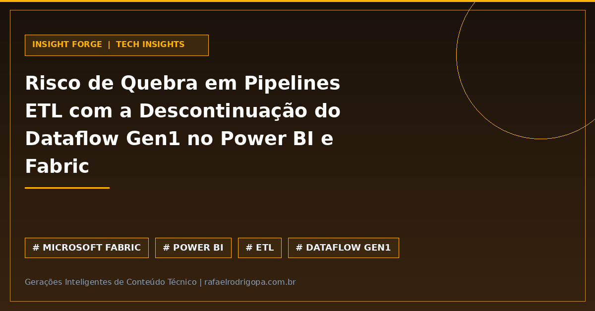

A descontinuação do Dataflow Gen1 no Power BI e Microsoft Fabric exige ação preventiva imediata das equipes de engenharia de dados. A manutenção de fluxos de carga nessa versão legada representa um risco real de interrupção em pipelines de ETL e indisponibilidade de painéis executivos.

Para evitar falhas em ambientes de produção e garantir a continuidade operacional:

⚙️ **Audite o ambiente:** Mapeie workspaces e identifique dependências ativas do Dataflow Gen1.
🚀 **Planeje a migração:** Transfira a lógica de transformação para o Dataflow Gen2 ou pipelines nativos do Microsoft Fabric.
🛡️ **Otimize a arquitetura:** Aproveite a transição para reestruturar o staging e a persistência em Lakehouses ou Data Warehouses, ganhando performance.

Como a sua equipe está estruturando essa migração no ecossistema Microsoft?

🔗 Confira mais sobre este e outros projetos no meu site, link no primeiro comentário

#DataAnalytics #DataEngineering #Python #SoftwareEngineering #Cloud #Analytics #SQL #CleanCode #TechCommunity #MicrosoftFabric #PowerBI

