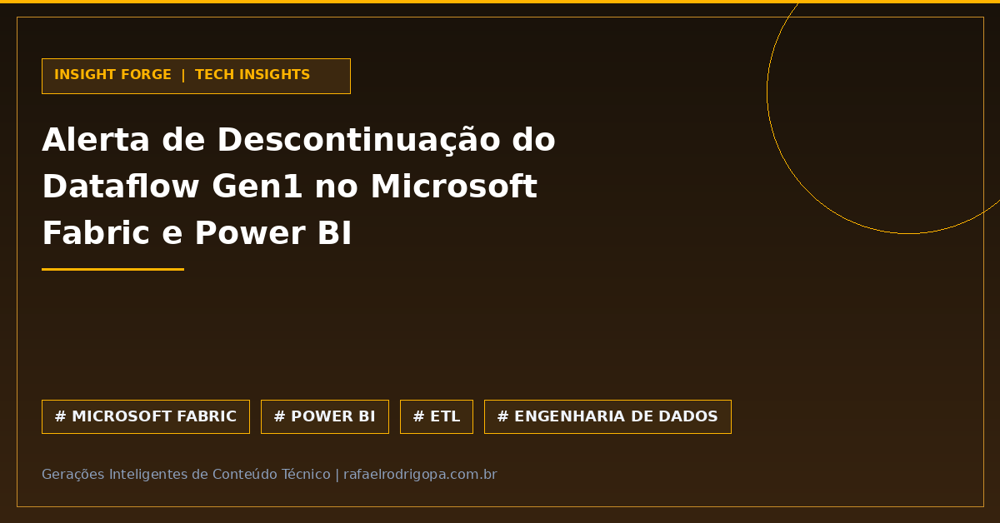

Seu ambiente de dados está preparado para a descontinuação do Dataflow Gen1 no Microsoft Fabric e Power BI?
Sem um plano de ação, pipelines críticos de ETL podem interromper o processamento repentinamente.

A consultoria EPC Group acendeu o alerta: a aposentadoria do Dataflow Gen1 impactará diretamente fluxos legados que não forem migrados a tempo.

Não se trata apenas de uma atualização de versão, mas de um risco direto à continuidade operacional e à governança da sua infraestrutura em nuvem:

⚠️ **Risco Operacional:** Interrupção iminente em pipelines ETL legados que sustentam o Power BI.
🚨 **Ação Imediata:** Mapeamento urgente dos fluxos em produção e migração para Dataflow Gen2 ou soluções modernas do Fabric.
⚙️ **Governança e Sustentabilidade:** Oportunidade para reestruturar a arquitetura e eliminar débitos técnicos acumulados.
🛡️ **Continuidade em Analytics:** Proteção contra falhas silenciosas que afetam dashboards estratégicos da empresa.

O seu time de Engenharia de Dados já iniciou o mapeamento dos Dataflows Gen1 ou vai esperar um pipeline quebrar em produção? Conte aqui nos comentários!

🔗 Confira mais sobre este e outros projetos no meu site, link no primeiro comentário

#DataAnalytics #DataEngineering #Python #SoftwareEngineering #Cloud #Analytics #SQL #CleanCode #TechCommunity

