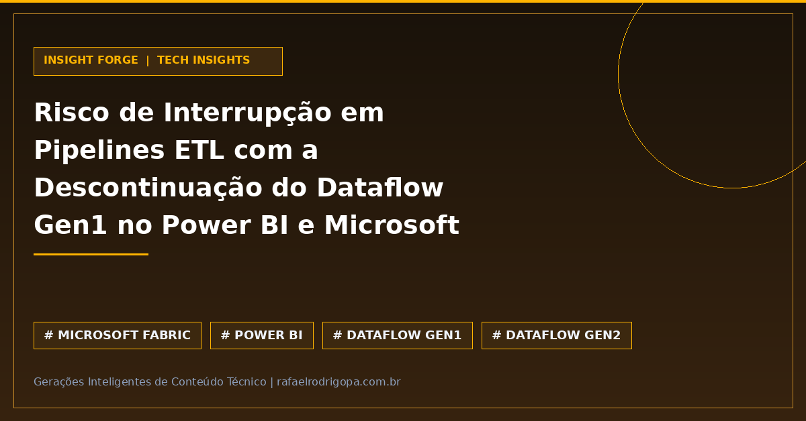

Sua empresa corre o risco de encarar falhas inesperadas em dashboards e relatórios do Power BI?
A descontinuação do Dataflow Gen1 exige ação direta sobre as arquiteturas de dados em produção.

Um alerta recente emitido pela consultoria EPC Group destaca que a aposentadoria programada do Dataflow Gen1 no ecossistema Microsoft vai interromper pipelines de ETL legados que não forem migrados adequadamente.

Para evitar descontinuidade na entrega de dados para o negócio, equipes de Engenharia e Analytics devem auditar seus fluxos e estruturar a transição para o Microsoft Fabric.

📌 **O que você precisa saber agora:**
⚠️ **Risco de Paralisação:** Pipelines legados baseados em Dataflow Gen1 sofrerão falhas definitivas de execução no ecossistema Microsoft.
📊 **Auditoria Imediata:** É essencial mapear dependências e a linhagem de dados para evitar indisponibilidade em relatórios executivos.
⚙️ **Migração Estratégica:** A transição deve focar na adoção do Dataflow Gen2 ou em Pipelines de Dados nativos no Microsoft Fabric.
🚀 **Ganho de Performance:** Além de mitigar o risco operacional, a modernização oferece maior escala e processamento otimizado.

E no seu ambiente, o time já mapeou quais pipelines ainda dependem do Gen1 ou a migração para o Fabric já está em andamento?

🔗 Confira mais sobre este e outros projetos no meu site, link no primeiro comentário

#DataAnalytics #DataEngineering #Python #SoftwareEngineering #Cloud #Analytics #SQL #CleanCode #TechCommunity

