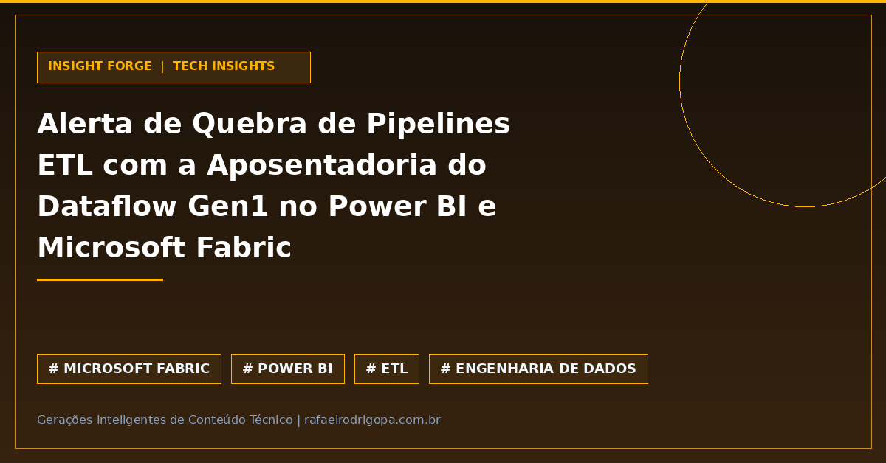

A substituição programada do Dataflow Gen1 no Power BI e Microsoft Fabric exige atenção imediata das equipes de engenharia de dados. Ambientes que mantêm fluxos legados correm o risco de sofrer interrupções na ingestão e atualização de dados caso não passem por uma auditoria preventiva.

Conforme aponta a consultoria EPC Group, a falta de planejamento para descontinuar o Dataflow Gen1 pode comprometer a execução de pipelines de ETL cruciais para a operação. A transição para o Dataflow Gen2 deixa de ser apenas uma atualização de recursos e passa a ser uma medida indispensável de continuidade operacional e governança.

🚨 **Risco Crítico:** Interrupção na execução de pipelines ETL legados no Power BI e Microsoft Fabric.
🔍 **Ação Imediata:** Auditoria do ambiente de dados para mapeamento completo de dependências ativas do Gen1.
🚀 **Modernização:** Migração planejada para o Dataflow Gen2 ou arquiteturas equivalentes na nuvem.
📊 **Impacto no Negócio:** Preservação da integridade e tempestividade dos dados em dashboards estratégicos.

Sua equipe já mapeou quais pipelines ainda dependem da primeira geração do Dataflow, ou a migração só entrará no radar após uma falha em produção?

🔗 Confira mais sobre este e outros projetos no meu site, link no primeiro comentário

#DataAnalytics #DataEngineering #Python #SoftwareEngineering #Cloud #Analytics #SQL #CleanCode #TechCommunity

