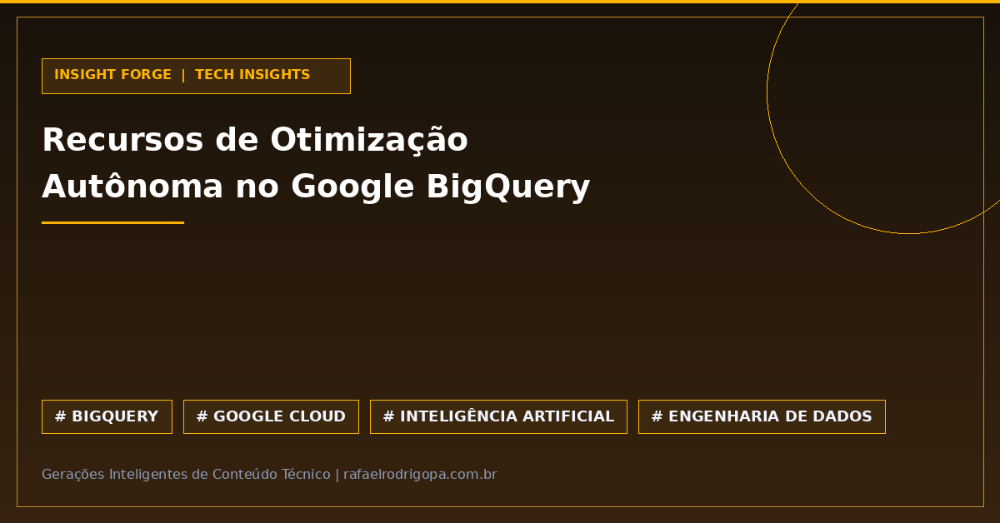

Ajustar consultas SQL complexas e gerenciar slots no BigQuery para evitar custos imprevistos na nuvem sempre foi um desafio operacional constante para equipes de dados.

Com a evolução dos recursos de aprendizado autônomo no Google BigQuery, o paradigma do ajuste manual de performance em data warehouses de grande escala passa por uma transformação significativa.

⚙️ **Auto-ajuste baseado em machine learning**: Aprendizado contínuo sobre o histórico de workloads para aperfeiçoar planos de execução.
🚀 **Otimização preditiva de consultas**: Redução do overhead de tuning manual de SQL e reorganização automática de rotinas.
📊 **Alocação dinâmica de slots**: Distribuição inteligente de recursos computacionais que equilibra alta performance e previsibilidade orçamentária.
🛡️ **Eficiência operacional**: Liberação da engenharia de dados para focar na modelagem e arquitetura, reduzindo a manutenção reativa de infraestrutura.

A automação preditiva redefine a gestão da stack analytics. Como a sua equipe tem se preparado para integrar esses recursos self-learning na rotina diária?

🔗 Confira mais sobre este e outros projetos no meu site, link no primeiro comentário

#DataAnalytics #DataEngineering #Python #SoftwareEngineering #Cloud #Analytics #SQL #CleanCode #TechCommunity

