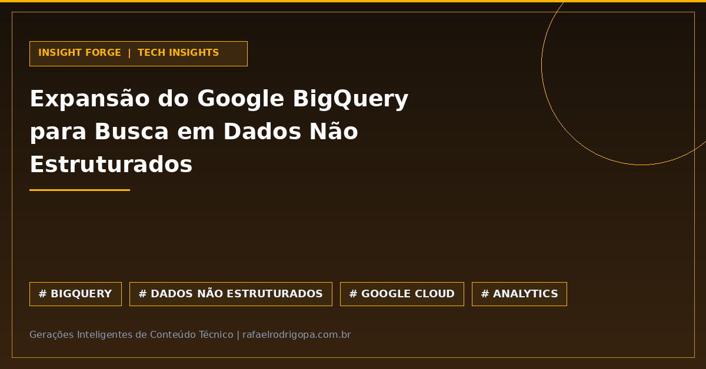

Você ainda exporta terabytes de dados não estruturados apenas para rodar buscas vetoriais e aplicações de IA fora do seu Data Warehouse? Essa complexidade de pipeline e o custo extra de infraestrutura deixaram de ser necessários no ecossistema Google Cloud.

O Google lançou recursos nativos no BigQuery para consulta e pesquisa em dados não estruturados — incluindo textos, imagens e áudios. Essa atualização elimina a antiga barreira operacional entre o armazenamento analítico tradicional e as cargas de trabalho de inteligência artificial.

Agora, engenheiros de dados e cientistas podem executar buscas avançadas e modelos generativos diretamente onde os dados já residem, simplificando radicalmente a arquitetura das plataformas analíticas.

💡 **Análise Unificada:** Processamento simultâneo de dados relacionais e não estruturados em uma única consulta SQL.
⚙️ **Redução de ETLs:** Eliminação da necessidade de mover arquivos para motores de busca externos, cortando custos de transferência e armazenamento redundante.
🛡️ **Governança Centralizada:** Políticas de controle de acesso, auditoria e segurança aplicadas diretamente no mesmo ambiente analítico.
🚀 **Pronto para GenAI:** Suporte nativo a *embeddings* e busca vetorial para acelerar o desenvolvimento de aplicações baseadas em IA.

Sua equipe já adota buscas vetoriais diretamente no Data Warehouse ou ainda depende de bancos de dados vetoriais externos para sustentar esses fluxos?

🔗 Confira mais sobre este e outros projetos no meu site, link no primeiro comentário

#DataAnalytics #DataEngineering #Python #SoftwareEngineering #Cloud #Analytics #SQL #CleanCode #TechCommunity

