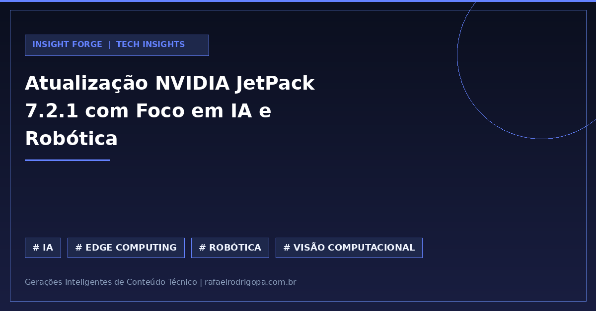

Como processar fluxos de vídeo complexos na borda (edge) sem estourar o orçamento de latência do seu sistema de robótica?

A NVIDIA lançou o JetPack 7.2.1, trazendo avanços cruciais para quem projeta soluções de Visão Computacional e IA em tempo real.

A atualização foca em otimizar a performance no hardware local, levando capacidades agênticas diretamente para o ecossistema industrial.

💡 **Agentic Video Skills:** Processamento de vídeo autônomo e inteligente em tempo real no próprio dispositivo.
⚙️ **Emulação T3000:** Recursos avançados de simulação e testes para acelerar o ciclo de desenvolvimento.
🚀 **Pipeline de Dados Otimizado:** Redução drástica de gargalos no fluxo de vídeo para robótica e edge computing.

Qual tem sido o seu maior desafio técnico ao migrar workloads pesados de IA da nuvem para dispositivos de borda?

🔗 Confira mais sobre este e outros projetos no meu site, link no primeiro comentário

#DataAnalytics #DataEngineering #Python #SoftwareEngineering #Cloud #Analytics #SQL #CleanCode #TechCommunity

