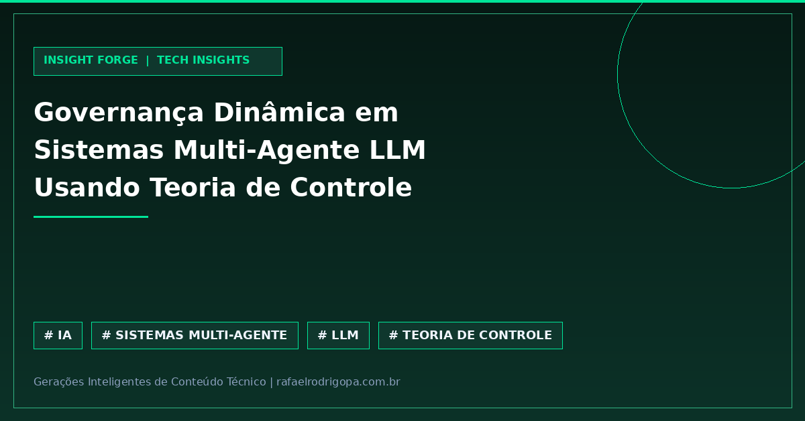

Múltiplos agentes LLM operando sem uma camada rigorosa de governança frequentemente entram em conflito, resultando em degradação de performance e falhas operacionais em ambientes de produção. 

Deixar agentes autônomos conversando sem controle estruturado abre espaço para loops destrutivos, especialmente ao interagir com usuários de alta variabilidade comportamental. A solução técnica passa por integrar engenharia de controle clássico diretamente na arquitetura de agentes.

⚙️ *Experience Orchestrator (EO):* Nova camada de governança que mitiga estagnação e colapso em conversas de múltiplos agentes LLM.
🚀 *Contextual Bandits + PID:* Combinação de seleção inteligente de conteúdo e controladores PID para impor restrições comportamentais determinísticas.
📊 *Rastreamento POMDP:* Modelagem probabilística de intenção para antecipar o comportamento do usuário em tempo real.
🛡️ *Salto de Performance:* Aumento de 32 pontos percentuais na conversão (78,1% vs. 46,1%) em um ecossistema simulado de 60.000 testes.

Como você lida com o desalinhamento comportamental em arquiteturas de múltiplos agentes na sua empresa?

🔗 Confira mais sobre este e outros projetos no meu site, link no primeiro comentário

#DataAnalytics #DataEngineering #Python #SoftwareEngineering #Cloud #Analytics #SQL #CleanCode #TechCommunity

