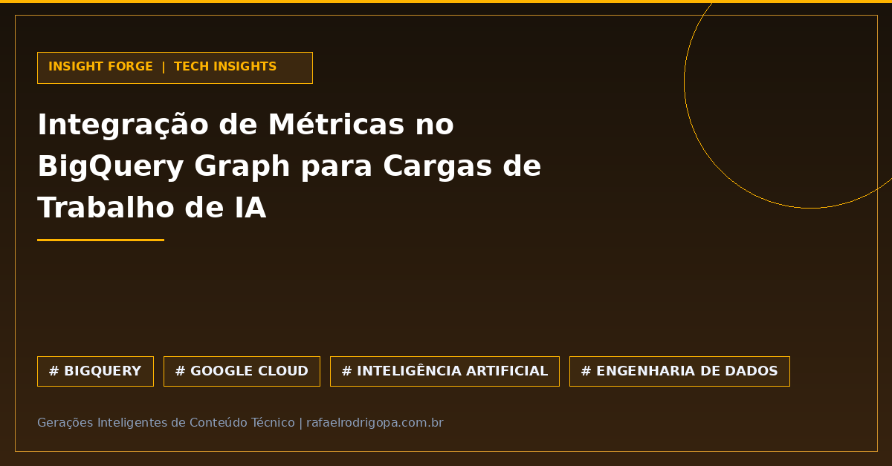

Sua equipe ainda gasta recursos significativos exportando dados do BigQuery para bancos de grafos externos apenas para alimentar modelos de IA?

O Google Cloud otimizou essa arquitetura com o lançamento de métricas nativas no BigQuery Graph, permitindo analisar relacionamentos complexos de rede diretamente no seu Data Warehouse.

Essa atualização elimina pipelines adicionais de movimentação de dados e fortalece estratégias como o Graph RAG, trazendo contexto relacional profundo para aplicações de Inteligência Artificial sem elevar a complexidade da sua infraestrutura.

💡 **Métricas Nativas:** Calcule centralidade e conexões de rede utilizando o engine analítico do próprio BigQuery.
🚀 **IA & Graph RAG:** Enriqueça prompts e LLMs com contexto estruturado direto da fonte.
💰 **Zero ETL Externo:** Elimine custos de egress e latência associados a bancos de grafos dedicados.
⚙️ **Ambiente Unificado:** Centralize armazenamento, análise de redes e IA em uma única stack no GCP.

Sua arquitetura de dados já está pronta para integrar Graph RAG de forma nativa ou a sua operação ainda depende de bancos de grafos isolados?

🔗 Confira mais sobre este e outros projetos no meu site, link no primeiro comentário

#DataAnalytics #DataEngineering #Python #SoftwareEngineering #Cloud #Analytics #SQL #CleanCode #TechCommunity

