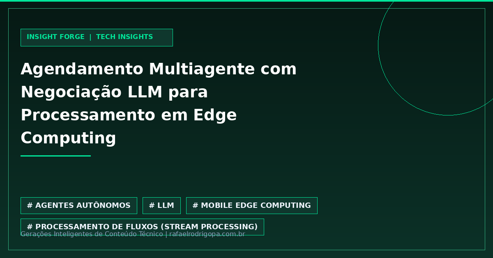

Como garantir latência mínima e zero sobrealocação em sistemas distribuídos quando o volume de dados em tempo real flutua de forma imprevisível?

O novo framework *MAS-DecStream* redefine a orquestração em *Edge-Cloud* ao evoluir o clássico *Contract Net Protocol* através de modelos de linguagem (LLMs) em arquiteturas multiagente.

A abordagem combina a capacidade semântica das LLMs para negociação flexível em múltiplas rodadas com a validação determinística rígida de restrições de infraestrutura e QoS.

💡 **Negociação Semântica:** O protocolo *LLM-MR-CNP* adiciona memória e contexto adaptativo ao CNP tradicional.
⚙️ **Arquitetura Híbrida:** LLMs lidam com incertezas operacionais enquanto algoritmos rígidos garantem os limites de hardware.
📉 **Desempenho Extremo:** Violações de latência caíram para 3%, eliminando totalmente a sobrealocação de recursos.
🚀 **Eficiência Provada:** Taxa de resolução de conflitos de 0,91 e ganho de até 22% de utilidade sobre baselines estáticos.

Você já imaginou substituir algoritmos tradicionais de agendamento por agentes LLM na sua infraestrutura?

🔗 Confira mais sobre este e outros projetos no meu site, link no primeiro comentário

#DataAnalytics #DataEngineering #Python #SoftwareEngineering #Cloud #Analytics #SQL #CleanCode #TechCommunity

